# SAHAYYAM 

Web portal to help NGOs to receive surplus food, clothes, books, etc. and the donor can easily donate,Front end implemented in Angular 8 
The separate User interface for donor and receiver The system displays Top donors to encourage donors.

## ScreenShots

- Home Page
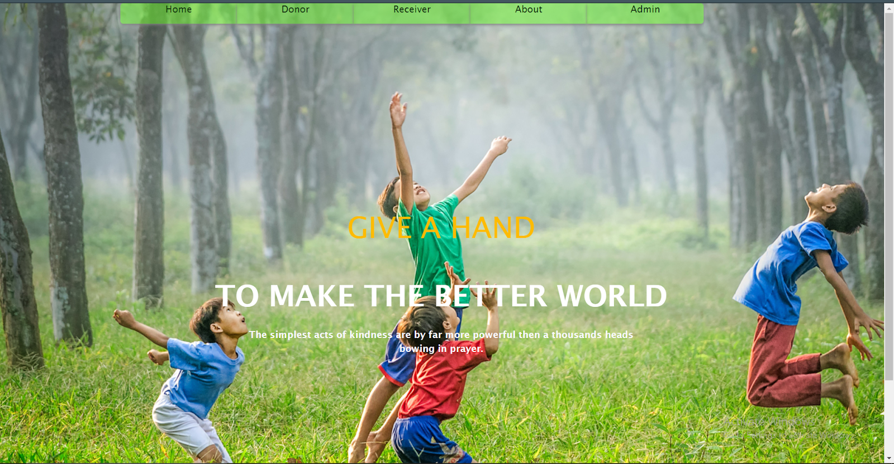

- Donor Page
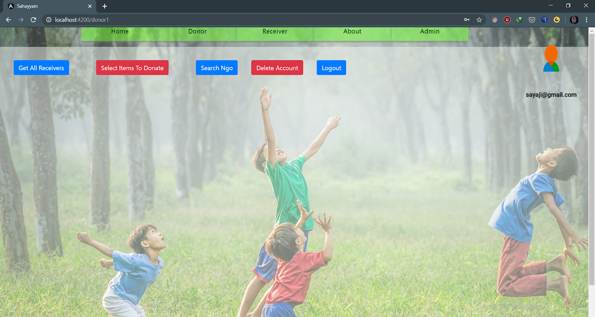

- Donor Sign Up
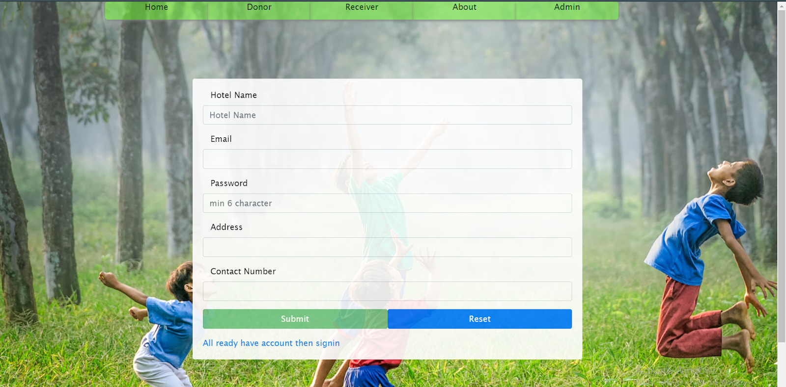

- Donor Sign In

- Select Items To Donate
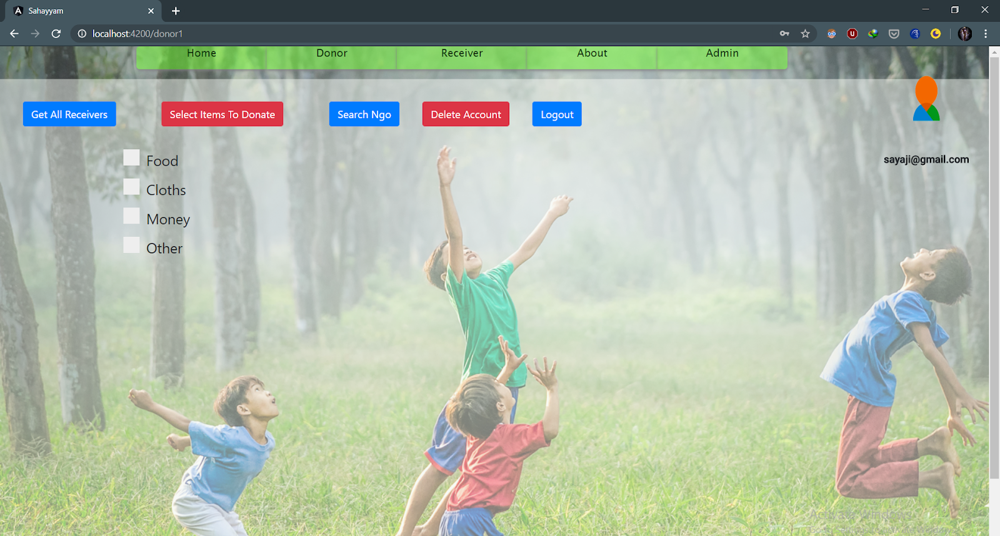

- Get All Receivers
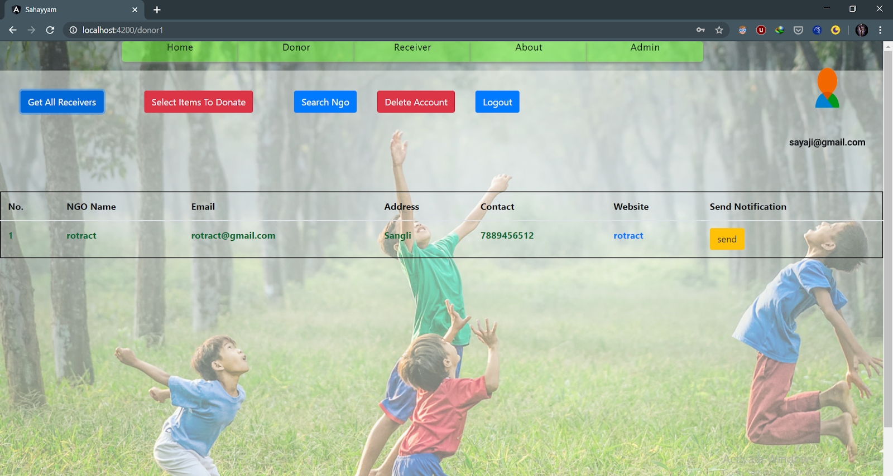

- Search NGO
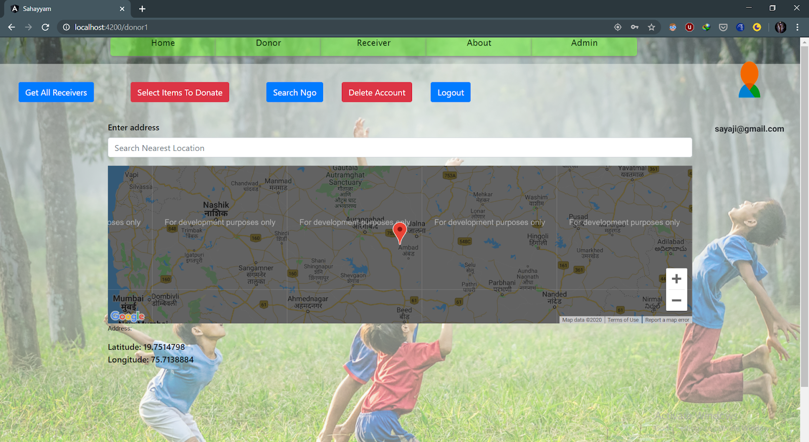

- Receiver Page 
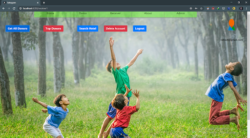

- Receiver Sign Up 
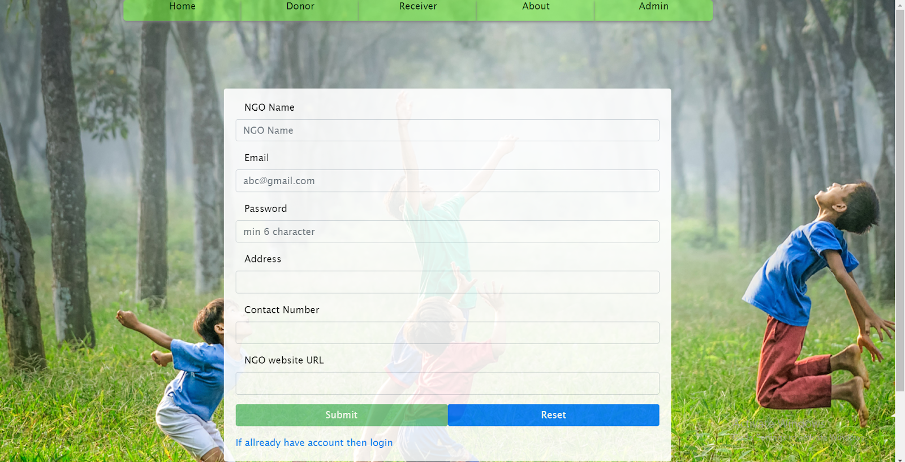

- Get All Donors
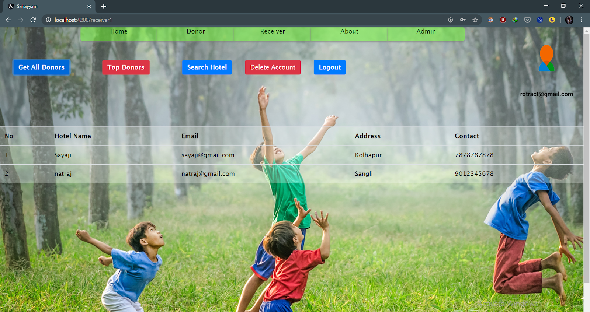

- Password Reset
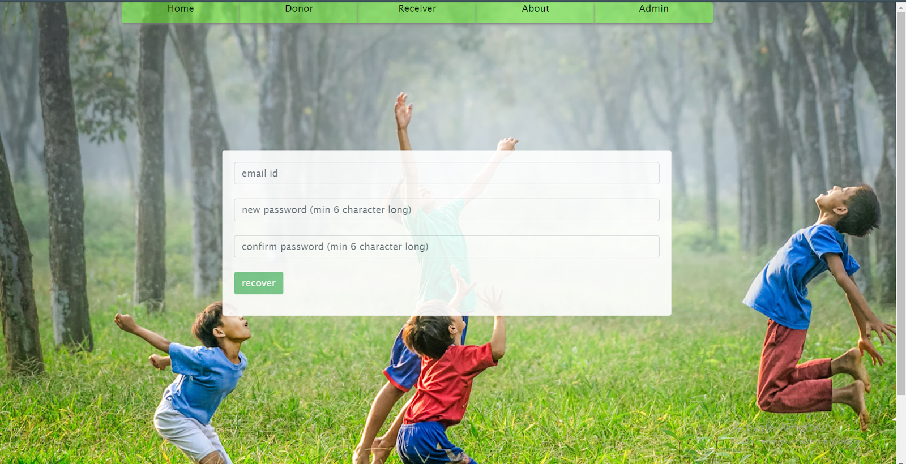
- Admin
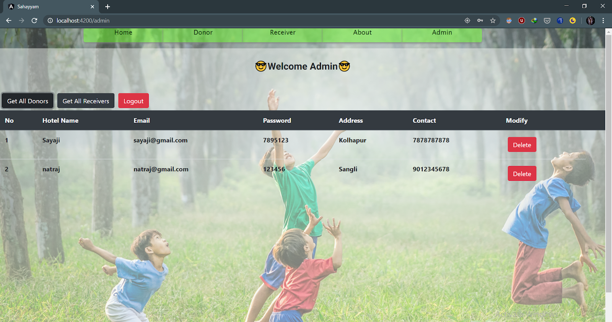
